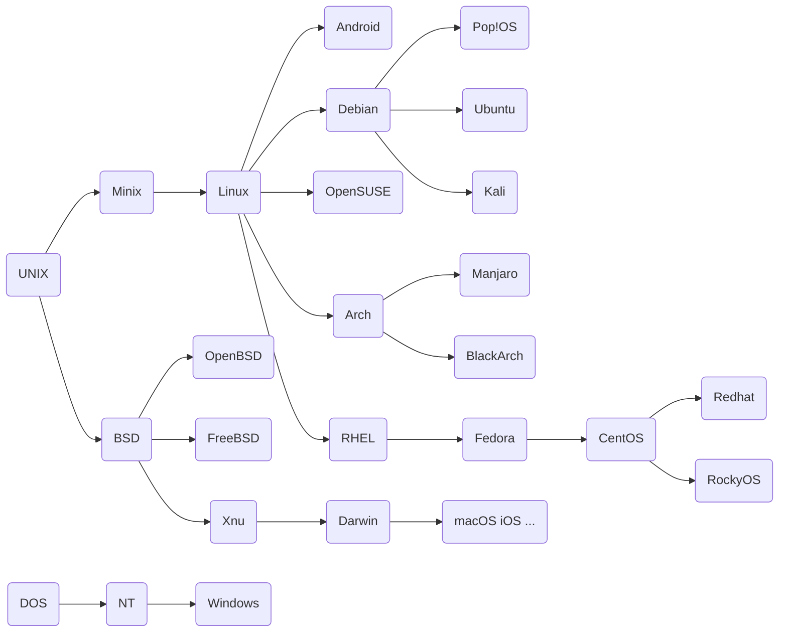
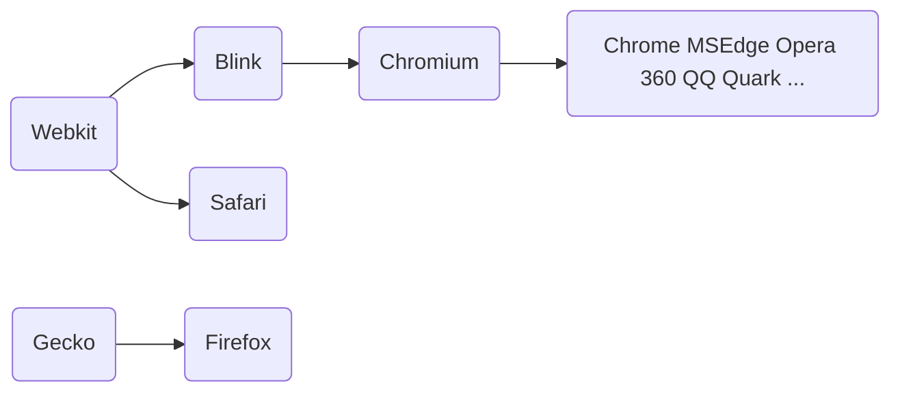
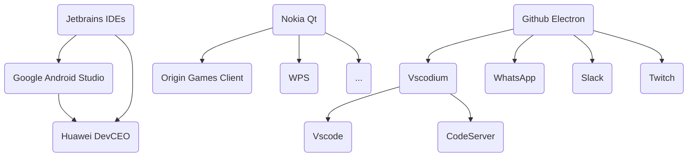
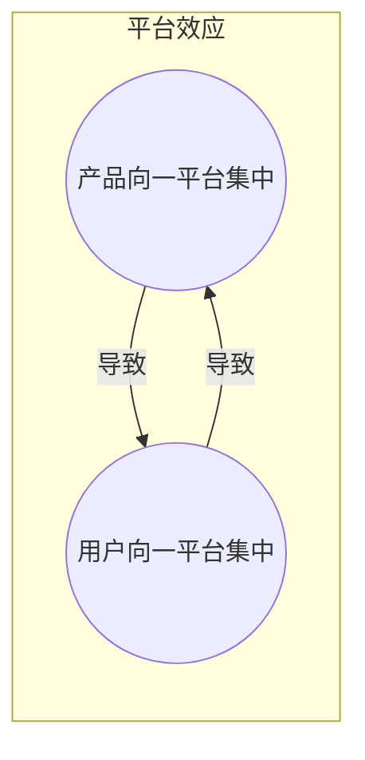
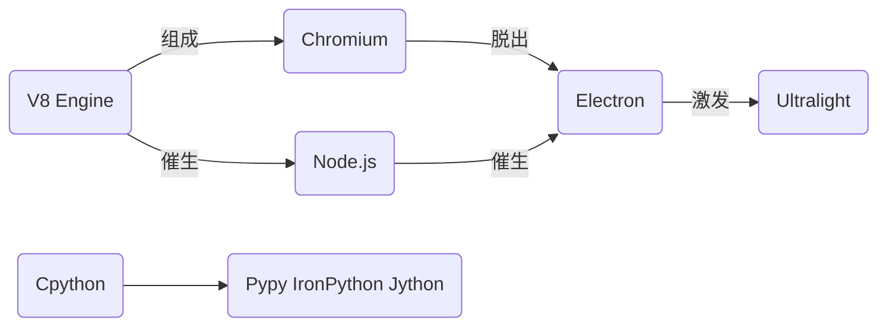

# 开源

本来是打算做演讲的，但当时写了《游戏杂论》，就没做《开源》的准备，这其实也有好处，时间长了，《开源》的内容便更加充实。

## 什么是开源

**开源，即开放源代码**，程序员之间共同创作或者共享资源的方式之一。大家可能不了解什么是开源，但大家一定用过开源的产品，有名的如Chrome浏览器的内核Chromium、Firefox浏览器、FFmpeg解码器、诺基亚的Qt（一套GUI系统）、最流行的版本控制系统Git、Linux系统、Android系统等等。此外几乎所有的语言或语言的实现，都是开源的，比如信息竞赛同学们常用的Devcpp，他用的编译器叫做gcc，就是C/C++语言的一个实现，其他的实现还包括微软的MSVC和基于llvm的clang，每个编译器有自己的特性，对于Code to ASM（代码到汇编）的过程有自己的优化。除了gcc，同学们接下来信息要学的Python的官方实现，Cpython也是开源的。某些语言的官方实现可能不开源，但会出一个开源的版本，比如Java，他的官方实现来源于Sun公司，现已被Oracle(甲骨文)公司收购，一开始是纯闭源的，后来出了一个开源的分支，叫OpenJDK，后来Java的主要开发工作从Oracle版逐渐向OpenJDK迁移，到现在，Java的开发流程已经变成了，先出OpenJDK，再出Oracle java，通常OpenJDK会比Oracle版的版本号要快一个版本，比如现在最新版的OracleJDK是18，而OpenJDK已经基本完成了对19的开发。因为OpenJDK的开源，我们在网络上便能见到许多个JDK的版本，都是OpenJDK衍生出来的，如微软的MSJDK，红帽的RH(Redhat)JDK，他们在语法上区别不大，毕竟都是对Java的实现，但在功能上会稍有一些区别，比如当你要玩Minecraft的时候，最好装Oracle的JDK而非OpenJDK，因为Oracle的JDK自带了JavaFX(一个JavaUI库)，这是Minecraft所需要的，而OpenJDK却没有这个，就得你自行下载安装（其实Oracle的JDK从11开始也不带JavaFX了，但谁让Minecraft在1.16之前一直用Java8呢）

### 开源的历史

想要深入了解一个东西，最好的方法不过了解他的发展历史。对于开源来说，开源运动的发展从一定程度上代表了软件行业的发展，我将其的发展过程大致概括为三个阶段。

##### 原始开源 "Free"

在软件行业发展的初期，由于硬件的限制，软件的功能往往很单一，只需要满足其载体所需的功能即可，就好比老人机，做的无非是打电话，发短信（但其实老人机不算这个时代的产品）。大家开发出来的软件都比较简单，故软件通常只被当作硬件的赠品来看待。加上当时的硬件世界还未统一，各家电脑自有自的指令集，软件流行起来比较困难，故很多软件在那时都采用开源的方式来帮助自己的传播，这种手段在一定程度上促进了软件宇宙初期软件行业的发展。这里举一个例子，叫做**UNIX**，诞生于**贝尔实验室**（同时期诞生于贝尔实验室的东西还有**C语言**，比UNIX迟了3年），这家伙可以说是现在所有操作系统的祖先，他可以算作这一阶段末期的产物，UNIX在初期是开源的。

##### 闭源与商业化

在硬件宇宙大致被主要由Intel(英特尔)、Microsoft(微软)与蓝巨人IBM构成的IMI联盟统一后，软件行业开始疯狂发展，加上之前初期已完成部分地基的开发（如系统、语言），开发的难度被大大降低，软件的复杂度越来越高，部分企业，如微软，便意识到软件可以成为一种商品，于是在DOS盗版大量流传之后，微软开始了对DOS的收费，随着时间的推移，靠软件赚钱的公司越来越多，其中包括苹果、Adobe这类元老级大厂。但重要的不是这些，而是上文那个“初期开源”的**UNIX**，**UNIX**内核在一段时间的完善之后被大量的公司作为服务器系统的内核，甚至一些大学也拿他做研究，衍生出了专门用来演示**UNIX**实现原理的**Minix**以及伯克利大学的**UNIX**修改版**BSD**等等。AT&T，也就是贝尔实验室的母公司，便反手将"**Free**"（免费/自由）改成了"**Enterprise**"（商业）。这手一挥，大公司如苹果，开始为UNIX交钱，中小公司，交不起授权费的，就只能辛苦点换内核，重写原来的软件。这还是公司，到了大学这种根本不靠产品盈利的地方，继续使用UNIX绝对没戏，于是也同样要么不用，要么改。上文提到的伯克利发行版**BSD**，在**UNIX**商业化后就大洗了一遍代码，在没有使用任何一句UNIX代码的情况下完成了对UNIX功能的实现，当然，这样做的开销是非常大的。

##### 商业化与开源交融

UNIX这么干引起了当时许多软件公司的不满，大家越发意识到开源不能想开就开，想闭就闭，得有一个协议，一个标准。在这种意识的引导下，诞生了一个重要的组织，叫做**GNU**，全称**GNU is Not Unix**（递归缩写，程序员的乐趣），它的图标是一头牛，**GNU**的发起者叫做**Richard Stallman**（还活着，我的偶像之一，下文还会写到我的另两个偶像）。**GNU**领导的运动叫做自由软件运动，其下主要包含了三个协议条款，分别是GPL（GNU通用公共许可证），LGPL（GNU较宽松公共许可证）与GFDL（GNU自由文档许可证）。由于一开始只有GPL，GPL是后两者之父，我们将这三者统称为GPL家族。GPL的主要特点是如果项目A是开源的，那么如果项目B由项目A修改而来，项目B也必须开源。这个特性被我们成为**GPL的传染性**，这种模式对于商业来说是致命的，即如果我用你的代码开发出了新产品，我的产品就必须开源，故后来诞生了LGPL和GFDL，以便商业公司利用开源技术创造产品，但即便如此，GPL家族的项目在开放性上的要求还是很高的，这可以从**Richard Stallman**对GNU的评价中看出，“我们希望用户对他们所用的软件具有完全控制权”。自由软件运动的另一大结果就是正式确立了开源的名字，将原本**“一语双关”的“Free”(自由/免费)**替换成了**明确的“Open-Source”(开源)**。

GNU到现在生命力依旧旺盛，许多的开源软件现如今仍采用GPL家族协议发布，其中最著名的莫过于**Linux**内核，由**Linus Torvalds**在大学用C花两周时间（神人，我的第二位偶像）完成第一个版本的开发，类似于BSD，是UNIX功能的另一实现。**Linux**的开源协议就是GPL。现如今，手机的安卓，大量的服务器，一些专业系统（比如政府单位的管理系统，甚至航天器的控制系统），以及少部分个人电脑（某些用Linux做开发的强者），都运行着**Linux**内核。由于GNU本来打算自己开发一个开源内核（GNUHurd）以彻底取代UNIX，但这个事情后来被Linux完成了，故我们有时将GNU与Linux并称为GNU/Linux体系。

由于GNU的高度开放性对商业化的要求过高，另一群人后来又成立了一个组织，以寻求**较宽松的 商业化与开源的平衡**，这个组织就是Apache，其下的开源协议就叫Apache（图标是个羽毛），其于软件界的地位与GNU相似，但没有GNU那般的传染性，故很多商业兼开源（这种模式其实挺好的，社区加公司进行维护）软件都采用Apache协议，其中就包括谷歌的安卓(安卓采用了一种很神奇的方式将Linux内核与服务/应用层隔离，避免了Linux **GNU**对Android的传染)。除Apache之外还有许多别的协议，比如麻省理工的MIT协议（OpenHarmony鸿蒙的开源版就通过MIT开源），BSD的BSD协议等等。

#### 小结

从**Free**到**Enterprise**再到**Open-Source**，从共享到为了盈利而私有最后回到共享，像极了人类社会从生产力低下的原始社会到文明的现代社会的发展历程，姑且将软件行业的发展看作是人类社会发展的一个缩影。(下面送的这张是系统族谱)




## 为什么要开源

### 于个人而言

于个人而言，开源带来的最大好处无非三个，其一是**更多选择**。就拿大家最熟悉的操作系统为例，我们使用Windows，Windows与Windows之间最大的区别无非是版本号的区别，什么Win7和Win8，Win8和Win10。但到了Linux阵营就不一样了，同样是Linux内核，你能找到一堆Linux操作系统，他们都是由Linux构建而来的，我们称这些操作系统为Linux发行版，其中著名主要分为Debian家族，包括常见的Ubuntu、Kali（一个网络攻防工具集系统，"Kali用的好，监狱进得早"）、Pop!OS等；Redhat家族，包括企业常用的Redhat、CentOS、Fedora；Slackware家族，目前活着的只剩OpenSUSE；Arch家族，目前较出名的主要为Arch和Manjaro。这么多发行版于Windows那样的商业系统而言是绝对不可能的。不仅大在发行版上我们可以“百家争鸣”，就算小到桌面环境，窗口管理，包管理，照样可以。

当你用了n年windows的默认桌面用腻了（其实于我而言默认也不错），你想着能不能换一个桌面环境，才发现Windows压根不能换桌面环境。而Linux则不同，你的桌面环境完全由你自己选择，什么KDE、Gnome、Cinemon、Mate、Xfce等等，自己选；窗口管理还是含糊点说，因为这玩意儿在表象上没什么大区别，目前用的窗口管理主要是X11和Wayland，后者较新（大概去年，因为要用6700XT跑Tensor加速，装了Linux来跑Rocm(AMD的机器学习底层框架)，当时X11没法很好得适配我的4K显示器，换了Wayland，结果因为显卡驱动太新直接崩了，当时很无语）；包管理是个什么东西呢？在Linux下，我们安装软件不走官网路线，也少有人用什么"应用商城"，只需要一条指令，比如你要装个git，在Debian系下就一条

```bash
sudo apt install git
```

回个车，等着他帮你下好，安装，补齐依赖，跑完进度条，就完事了。卸载东西也很简单，你可以一条

```bash 
sudo apt list --installed
```

列出已经安装的软件，然后一条

```bash
sudo apt remove git
```

将其卸载。与桌面环境一样，包管理器也照样一堆，什么**pacman**、**yum**等等。

这时便有人问，既然功能都一样，为什么要做那么多，有一个不就够了？因为这些东西往往在专业性与易用性间有自己的平衡，如Ubuntu，Pop!OS对于新手来说安装简单，不需要手动管理太多东西，基本上就是"Install and Play"即开即用，适合Linux新手或对Linux使用需求不是很高的人，而Arch、Debian这类，在安装上比较困难，前者更是全靠命令安装，格式化硬盘要敲`mkfs`，然后`mount`挂载分区，`pacstrap`安装所需包，自由度那是相当高，装起来也是相当困难。

第二个好处便是**降低某些门槛**，尤其是对我这种技术力低下而又痴心于开发的人来说。这里先介绍一个网站，Github，上文我提到过Git，目前最主流的版本控制软件，与他地位差不多的还有个SVN，两者的区别在此不谈（分布式版本控制与集中式版本控制，前者更适合社区化开发，后者更适合企业的产品开发）。Github是个宝库，上面有各种各样的项目及其说明，这是世界上最大的开源社区，于是打开他的官网你最先看到的便是"Where the world builds software"(世界在哪里构建软件)。确实，它也抵得上这个称号。2021年的寒假，我在家发神经忽然想做个微信聊天机器人，本来是打算用在当时已较成熟的python库itchat做的，itchat走的是微信的WebAPI，结果没想到的是就在寒假前不久腾讯突然发神经把WebAPI给ban(封)了，这不仅导致我无法达成做机器人的愿望，还“奶奶的”(来自吕航，高一时的语文老师)把我的微信的网页端给封了，现在要是用网页端登录我的微信，收到的便是"为了你的账号安全，此微信号不能登陆网页微信"。这下怎么办呢？当时几乎所有的成熟的微信接口用的都是WebAPI。于是我便在github上逛，找了半天终于找到一个叫做wechat_pc_api的仓库，这个家伙用hook实现了对微信PC端接口的调用，这事我肯定是不会的，毕竟我连CE找基址的事情都干不来，更别说调hook了。好在这位dualxu(用户名)，他将他的hook做成了dll，并写了详细的接口说明。要知道python的ctypes是可以调dll的，我的机器人这下算是有戏了。

同样的，当你的某位高中同学在为如何将cr2格式的图片转换成jpg格式的问题而头痛时，你只需github上随便一搜"cr2 convert"然后发现一个名叫Libraw的C++库，你发现你并不会C++，于是继续搜，又发现有人用Libraw封装了一个叫rawio的库，这个你可以用，于是打开Vscode，看着rawio的官方介绍随手写下几行代码，将这个转换的程序打包成exe发给你的同学，问题便迎刃而解了。降低门槛的例子还有很多，比如你在B站上能看到明明不是3b1b（3Blue1Brown）的up主的视频，却与3b1b的视频有相似的动画演示，这是因为3b1b把他们团队开发的数学渲染引擎manim开源了，这个manim引擎如今也能在github找到，现其正式版已交给manim社区维护，开发版（现更名为manimgl）由原团队继续开发。

第三个好处不必多言，就是**安全**。这自然不需要什么解释，人家源代码都直接露给你看了，谁要还说他不安全，就无异于让其从肚子里挖出一碗粉（《让子弹飞》六子）来证明自己了。

### 于企业而言

开源对个人有好处，对企业来说自然也是有好处的。这里的好处照样可以分点。目前看来，主要包括两个点，其一是**可控**。企业是生产产品的地方，产品的运营稳定是企业对产品的基本要求之一。那么如何保证稳定呢，自然是产品的运行尽可能多地能被企业控制。开源在这方面上便提供了一定的保障。如果你在2021年搜索上文提到的**BSD**，便会发现，相较于**Linux**，**BSD**的用户貌似少去很多，几乎没有像Linux那般的个人用户使用它。但你若是加上**“服务”**二字，便能发现这能搜到的东西一下子又多出许多。**BSD**自诞生起，就一直保持着开源的存在形式，目前市面上主要分为两套**BSD**发行版，**OpenBSD**和**FreeBSD**，他们与**Linux**最大的区别就是**BSD**家族的发行版都相当干净，除了系统基本的组件、服务以外，几乎没有任何别的东西，所有的软件，依赖，都由用户自己安装，这对于个人用户来说自然是痛苦的，但到了企业头上，他们需要的恰恰就是这种没有其他因素干扰产品运行的环境，这便是即使没有那么多用户，**BSD**至今仍充满活力的原因。既然说到了BSD，在此也不妨一提，原本苹果的系统用的是**UNIX**内核，现在大家都知道**UNIX**倒了，那苹果用什么呢？在乔布斯被苹果赶出董事会成立NEXTSTEP又被召回苹果之后，乔布斯决定将原先的苹果系统进行重写，对老旧的**UNIX**内核进行一次大换血，这次换血的最终成果便是基于**BSD**的**XNU**内核，后来又进一步封装成**Darwin**，而这个**Darwin**正是目前所有苹果系系统，即macOS、iOS、iPadOS、watchOS、TVOS的共同内核，**Darwin**内核既然由**BSD**开发而来，自然便遵循**BSD**的开源协议，这也是你现在在github上可以搜到他的内核仓库的原因。

另一个点还是**降低门槛**，不过这与个人开发的降低门槛有所不同，个人开发多趋向于**使用**开源项目，而企业则部分**基于**开源项目。这里的例子便非常好举了。作为现代人，大家应该都知道浏览器是什么东西。说到浏览器，最先提到的基本都是Google的Chrome、Mozilla的Firefox、Microsoft的Edge和IE、Apple的Safari，然后就是一堆国货什么360、捷豹、qq、遨游、华为、百分、夸克等等等等。这些浏览器虽然看起来十分复杂，但是其实可以大致分成三四个家族，其中最大的，下崽最多的，便是谷歌的Chromium家族，Chromium是Chrome的开源版本，一个未上色的Chrome，他还不算是谷歌的**产品**，其开发进程由社区维持，与上文提过的Java一样，Chromium在版本号上也通常比Chrome要高1~2个版本，如Chrome出97时，Chromium就已经出99了。Chromium作为Chrome的开源版，或者直接称为他爸，在功能上与Chrome基本没有差异，除了某些小区别，比如Chrome比Chromium改进了一点渲染引擎，速度稍微快一点，且由于H.264解码的专利问题，Chromium并不支持播放H.264编码的视频，而Chrome作为商业产品，自然得满足这个需求，这也是为何当你使用Chromium做浏览器时在某些视频网站上（包括B站、油管）可能无法播放视频的原因。当然，这不是无解的，开源之自由，个人用户能自己给Chromium安装支持H.264解码的库，但手动安库这件事，对于普通用户来说，还是太困难了。

那么这和家族有什么关系呢？正因为Chromium是开源的，加之Google对Chromium的开源协议设得相当宽松，自然也会有其他厂商来基于Chromium制造自己的"Chrome"，这些"Chrome"就包括基本所有的国产浏览器（甚至可以不用"基本"），也就是说，你用360、捷豹、遨游、QQ、华为、百分、夸克浏览器，除了能够享受部分定制功能以外，到头来与用Chrome没什么大区别。当然除了国产的浏览器，国外也有不少浏览器是基于Chromium的，比如微软的新版Edge浏览器（老版的引擎是EdgeHTML）、Opera浏览器、Vivid（国内不常用）、开源社区的另一产物Brave，他们也是基于Chromium的。这下血缘关系理明白了，将这一堆儿子们都理入Chromium家族就是。

当然除了Chromium内核以外浏览器界还是别的内核的，比如臭大街的IE，用的Trident，且只有他一个人用；Chromium基于blink，衍生于是Webkit，现在这俩的关系已经撇清，而这个Webkit现在是苹果的Safari的内核；Mozilla的Firefox也有自己的内核，称为Gecko。除去这些，基本没多少活得还不错的内核了。

至于为何说这能**降低门槛**呢？这就得看看国产浏览器中部分恶臭的嘴脸，360、QQ、捷豹，你可能觉得他们的浏览器用着还不错，但他们本身并不是来做浏览器的，而是借着浏览器的默认引流赚钱，顺带加些同样恶臭的广告，左边再放一栏什么游戏链接，这样的目的，假如没有开源，没有Chromium，他们大概率就不会开发浏览器，毕竟浏览器的开发是相当困难的，不仅要求你的浏览器能正常运行，而且还要快（参考Chromium与Firefox的跑分差距，我不相信哪一个国内企业愿意花钱，且能研发出跑分比Chromium高的浏览器，或者不必说Chromium，可能连Firefox的跑分都跑不过），要小，要即开即用，这么一来，他能赚来的钱甚至不及研发投入的钱。而现在有了开源，有了Chromium，这些企业就可以轻松地改一改，然后反手一拍，说是自己也有了浏览器。这不是降低了生产产品的门槛吗？赚钱真是容易多了呢。




同样的，**降低门槛**的例子还有很多，不一定都是恶臭的，但多多少少都借了开源的力。如部分人所熟知的手游模拟器（在电脑上运行手机游戏），什么网易的Mumu、腾讯的手游助手、蓝叠、夜神、逍遥、雷电，都由Oracle（甲骨文）公司的一个开源虚拟机产品，VirtualBox，修改而来，其中所运行的Android系统，也是Androidx86社区由原版安卓修改来的。前端时间华为也整了个什么移动应用引擎，终于是一个跟VirtualBox没关系的虚拟机软件，但你打开他的目录一看，好，qemu四个大字。这个qemu是什么呢？这家伙不仅可以跑虚拟机，甚至还能模拟指令集，比VirtualBox还要强大，不过他本身的定位并不是给普通用户使用的，故正常情况下使用只能用指令操作，且基本都在Linux下使用。这么厉害的神器，自然也是开源的。当然，产品所基于的开源项目不一定也是产品，可能只是一个封装好的库，就如大名鼎鼎的FFmpeg，这个家伙你可能没有听说过，但你只要看视频，就大概率和这个家伙脱不了干系，什么腾讯视频、爱奇艺、以及当年的暴风影音，他们的媒体解码器都是这个玩意儿，或者你打开你那浏览器的根目录，下面便会赫然出现一个叫`FFmpeg.dll`的文件，这下也便不必讲了。

好吧，例子实在太多了，想讲完，但又觉得那样论证实在是过于`充分`了，这里就用markdown画一张小图概括剩余的例子，不枉我辛苦构思。



### 于国家而言

上文讲完了开源对个人与企业的影响，这里先小提一下开源与国家的关系，关于这块内容，我决定到后面再详细解释。大家都知道谷歌对华为进行了封锁，但都不知道封锁到什么地步，究竟封锁了什么。很多人说谷歌不允许华为使用安卓，并非如此，封锁的内容主要是GMS，谷歌移动服务，封这个对于我们国内并没什么影响，毕竟谷歌在国内向来是404的存在(HTTPStatus404：内容不存在)，连都连不上，谁用谷歌那什么服务。但这一封锁对国外华为手机的销售影响还是很大的，国内手机应用商店五花八门，华为一个应用商店，小米一个商店，甚至腾讯这不做手机的都有个应用宝，国外则大都是清一色的Google Play，现在这禁止华为使用GMS，就是手机出场没了应用商店（其实不止这个），对于国外用户来说，自然是痛苦的。但好在安卓是开源的，且由Apache基金会运营，谷歌没法禁止华为基于AOSP（Android Open-Source Project，即安卓开源项目）进行开发，撑死了禁止华为使用自己的安卓发行版，华为向来就是自己做发行版的人，这禁用发行版，就是禁了等于没禁。故从这一方面来看，开源在国家之间，还是较为公平的。

### 于行业而言

如果我们将视界再扩大些，直接到整个软件行业的地步，那么开源的好处又将发生变化。其中最易于解释的不过所谓“**前人栽树，后人乘凉**”，旧项目的开源大大降低了新项目的开发难度，如此，整个软件行业才能长远发展。相反地，假设没有一个人开源，那么50年前做一个播放器的难度是100，50年后他将仍会是100，无论什么产品，都得从头造起。软件可算是知识经济，这样肯定是走不远的。故我们便可以开源认作软件发展的必然趋势，或者可以扩得更大些，不止是信息，而是所有的知识经济产业，他们若想要发展，就必然得走向开源。

除了这一个最宏观且最重要的意义以外，开源还能促进**形成统一标准**，且在一定程度上**阻止垄断和生态封锁**。如果同学们打游戏，又在乎帧数，多少会知道DirectX、Vulkan、OpenGL是什么东西。这仨都是显卡绘图用的图形API，不同的是DX是微软为Windows平台开发的专有API，而Vulkan、OpenGL则是Open组织的开源API。至于为何说其能够一定程度上阻止垄断和生态封锁呢？如果没有vulkan，没有OpenGL，所有与图形渲染相关的软件都只适配DirectX，且显卡厂商也只考虑DirectX，就会导致用户堆积在DX上，使得微软在图形绘制市场上拥有绝对话语权，最终整个市场便陷入生态封锁的恶性循环：对于企业来说，不用微软的API就没有用户，没有用户就没有钱赚，所以必须用微软的API；而对于用户来说，没有软件不用微软的API，故最好选微软的API来运行自己想要的软件，久而久之，其他API将越发边缘化，于是这个世界上就只剩下DX了。故这个时候有一个统一的，共享的API便非常重要。而目前做到统一共享，最佳的方式莫过于开源。



最后，开源项目还容易催生出新技术，这其实要部分归功到上文所述的**前人栽树后人乘凉**上。这里还是举Chromium的例子，但是这次要说的是技术不是产品。学过Web前端的同学都知道正常情况下一个完整的前端主要包括三个部分，HTML、CSS和JS，浏览器所做的事情不过是与服务器沟通，最终将这些内容处理后显示到用户的面前。Chromium的JS引擎叫做V8，是目前所有JS引擎中性能最强的（只能说SuperJIT）。一群年轻人见这个V8引擎这么强，于是便将其从Chromium上又拆了下来，做成了独立的JS运行时（runtime），这个运行时就是Node.js。诞生至今，随着Node.js用户的增长，Node.js的语言生态也爆炸式增长，就目前而言，其在包数量上甚至不输于大家熟知的胶水语言Python，也正是出于这个原因（加上js语法较简单），华为在设计鸿蒙时使用JS作为应用语言而非Android热爱的Java和Kotlin。而Node.js并不是我要说的重点，要证明容易催生这容易二字，就诞生区区一个技术怎么足够，接下来才是好戏。随着Node.js的发展，一部分人开始挖掘Node.js的产品能力，于是又来了一群年轻人，更为大胆，在结合了Browser Runtime与Node Runtime后，开发了一种能靠前端开发应用的技术，这便是github的Electron，Electron借助于Node.js强大的生态，大大降低了开发桌面应用的难度，而由于其本身脱胎于浏览器，跨起平台来也特别容易，于是便迅速成为了软件开发的新宠，基于Electron开发的著名软件主要包括神之编辑器Vscode、国外的微信WhatsApp、游戏社区Twitch、设计软件InVision、Markdown神器Typora、基于Aria2的下载器Motrix、新版的微软Teams、思维导图软件Xmind、数学绘图Geogebra、华为新出的电脑版应用商城。都没听过？那只能怪国内某些恶臭的产商不愿意更新技术了。哦，同学们小学学的那只小猫，Scratch的3.0版本，也是基于Electron的。Electron大大降低了软件的开发难度，甚至到了个人能做企业产品的地步。不过Electron也有弊端，就是他包含了一个完整的Chromium内核，而一个内核的大小约为100MB，也就是说不管你的软件是干什么的，起步大小都是100MB，甚至只是显示个“Helloworld”也得100MB，不过解决这个问题的事情已经有人在干了。Ultralight，旨在创造一个轻量且高效的前端渲染器。




## 开源的现状

### 世界

上文已经阐述过开源的必然性，随着知识经济发达程度的升高，开源的程度也会越来越高。就目前的世界而言，开源正越发成为推进行业前进的主要动力，越来越多的企业开始参与开源的事业，比如CPU领域原本由专利化的x86与ARM占领，大约5年前杀入了一支异军，RISCV，这个指令集就是开源的，之前与现在RISCV地位相当的mips指令集没能招架住RISCV直接开源的强大威力，现在已被迫开源。相信随着时间的流逝，开源在这些专利市场中的地位将越来越重要。

但即便开源正在茁壮成长，我们仍无法否认仍有企业在构建生态封锁，这里最简单的例子就是英伟达在CUDA上的垄断，游戏玩家可能知道只有N卡能光追（其实现在AMD也行了，但是有些拉跨），这两者的本质是一样的。英伟达精心地构建着自己的封闭帝国，妄图制造上文所述平台效应的循环，以使自己在整个行业拥有绝对话语权。关键是他还干得不错，现在大学里谁要是想学人工智能，第一件事肯定是去买一块英伟达的显卡，因为别的显卡加速模型训练要么要靠其他平台支持(就比方我上文提的AMD要靠在Linux的Rocm)，要么干脆不支持训练。显卡训练只需要千分只三秒的mnist实验，我显卡不支持，给CPU训，硬生生花了二十几秒。

除了正在构建的生态封锁，还有许多历史遗留的生态封锁，最简单的不过于Windows操作系统，为什么大家都用Windows，而不用更安全更稳定的Linux？无非因为Windows早就构成了坚实的软件生态。那平台效应，微软已玩得不能再熟了（参考微软是如何从空白中一步步建立起自己的Xbox帝国的）。

全面拥抱开源的路还十分漫长啊。

### 中国

上文我提了许多关于开源的产品或技术，但国内的声音貌似特别小，除了到那恶臭的部分浏览器时以产品的形式现身了一下，别的地方就再也没出现过。不是我藏着掖着，国内开源的状况貌似就是这么差。<u>我们的企业貌似只是喜欢使用开源项目，而非创造开源项目，故国内的开源多以个人项目的形式出现（程序员本来就是被压榨的对象，能抽出时间来做开源就算很了不得了，更何况项目还得发展到一定地步，最终靠着被公司看上来运营，参考yuyz大佬的的项目rrweb），明显缺乏像GNU、Apache那般对开源有强力支持的的组织。</u>虽然国内也有许多存放开源仓库的站点，如Gitee、OSChina，但这些站点到头来不过只是个放代码的地方，我们所需要的远远不只是一个放代码的地方。这时便可以引出我的最后一位偶像，尤雨溪，尤大，这个家伙太强大以至于成为了我语文考试作文的素材。尤大毕业于上海复旦附中，在美国完成大学学业，毕业后在谷歌的创意工作室（Google Creative Lab，这个地方出了很多知名项目，Dart、Flutter什么的，不过都赛不过尤大的Vue）开发出了著名的前端框架，Vue.js。其（现由尤大全职开发）在github上的star数高达192k，超过Facebook的React（180K）和Google的Angular（78.6K），成为世界前端界的第一框架。你若今天打开尤大在Github上的个人主页，就会在他的头像下面看到两个硕大的奖章，一个NASA火星无人机的源码贡献者勋章，还有一个是北极代码仓库计划的源码贡献者勋章。这种人自然是神人，但这神人是华裔，他这些开源的成就都是在国外达成的，为什么我们国内就没法出一个Vue般的框架呢？这个课题就得让时间来回答了。

好消息是国家已经开始重视这件事了。软件作为知识产业的代表，开源应该成为我们迈向共产那般共享的第一步。去年得知开源被列为十四五计划目标之一，一时高兴地无法言语。愿中国能以开源的形式击破平台效应的壁垒吧。

-------

初稿完于 2022年1月1日，文本使用Markdown撰写，网页端渲染由Marked.js、Highlight.js、Mermaid.js（都是开源的哦）支持。Github@XingZhe-Li
